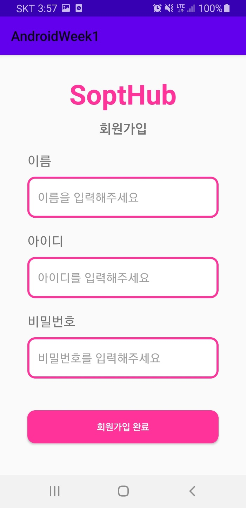
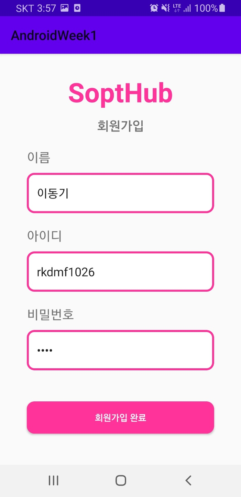
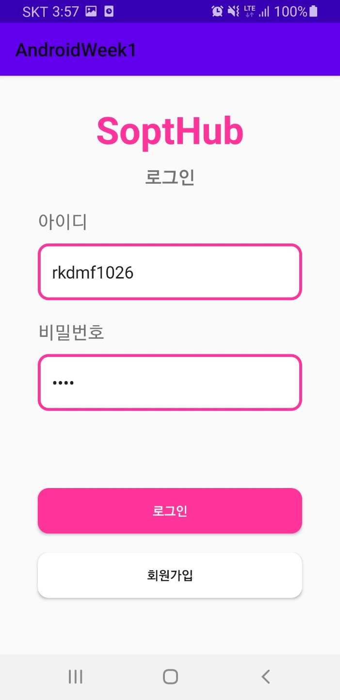
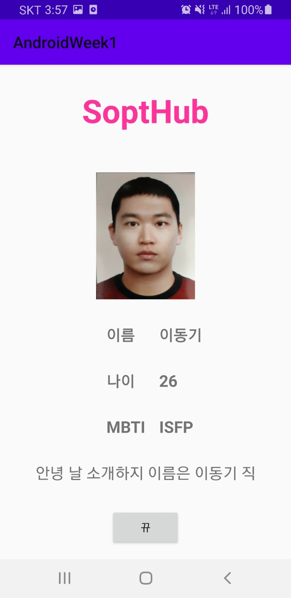
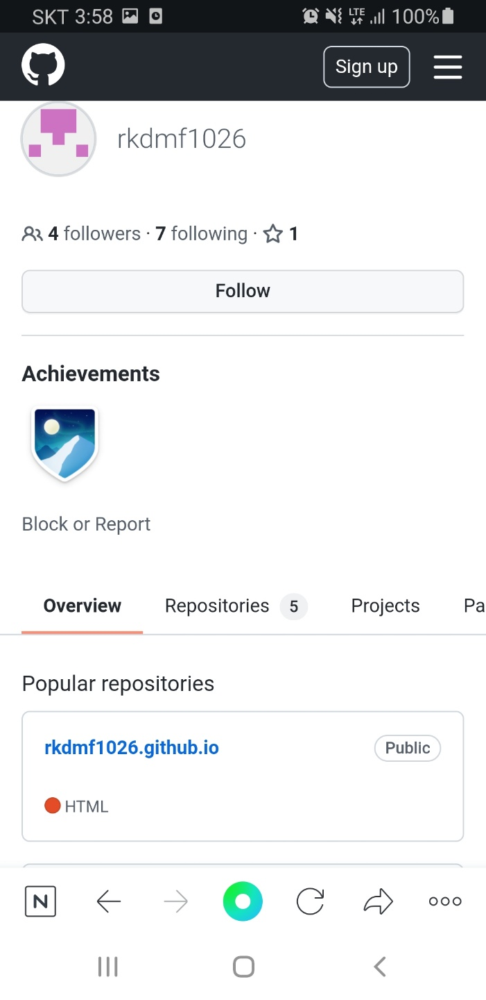

# Sopt Homework Week1
---
## Content
- SignInActivity & SignUpActivity
- HomeActivity
- 고찰
---

## SignInActivity & SignUpActivity


[SignInActivity]

먼저 SignActivity는 Databinding을 사용하였지만 실제로는 ViewBinding과 같이 xml의 id를 참조하는 식으로만 사용하였다.
로그인 버튼의 setOnClickListener에 조건문을 달아, 아이디와 비밀번호를 적는 각각의 EditText가 하나라도 비워져 있을 경우 "로그인 실패" 라는 토스트 메시지를 띄우고, 다 채워져 있을 경우에는 "이동기님 환영합니다" 라는 토스트 메시지를 띄우고 HomeActivity로 이동하게 하였다.(이는 Intent를 사용하여 액티비티 전환)
회원가입 버튼 또한 setOnClickListener에 Intent를 사용하여 SignUpActivity로 이동하게 구현하였다.

---


[SignUpActivity]

SignUpActivity 또한 회원가입 완료 버튼 이벤트 발생 시 조건문을 달아 EditText가 하나라도 비워져 있을 경우 토스트 메시지를 출력하게 하였다.

---


[SignUpActivity]

비밀번호는 InputType에 "textPassword"를 줘 입력 내용이 가려지게 하였고, 회원가입 완료 버튼 클릭 시 Intent를 사용하여 SignInActivity로 이동하는데 이 때, putExtra를 사용하여 EditText의 내용을 String 형태로 같이 보낸다.

---
## HomeActivity



[SignInActivity]

SignUpActivity에서 보낸 데이터들을 getStringExtra(String)로 받고 그 값들을 각각 EditText에 setText 해주었다.

---



[HomeActivity]

HomeActivity은 처음에 다른 액티비티들과 같이 MVC패턴으로 구현하려 했지만, 알 수 없는 에러와 자괴감, 능력 부족으로 인해 MVVM 패턴으로 구현하게 되었다.
Databinding을 사용해서 viewmodel의 name,age,mbti,pr,image LiveData들을 초기화하여 뷰를 갱신하였다.
ScrollView를 사용하여 스크롤이 가능하게 구현했으며, constraintDimensionRatio 속성을 이용하여 가로,세로 한쪽 기준에 맞춰 1:1 비율로 구현하였다.


Imageview의 경우에는 BindingAdapter를 이용해 구현하였다.



Git 버튼을 클릭하면 암시적 인텐트를 사용하여 웹브라우저를 통해 내 깃허브 프로필 주소로 이동하도록 구현하였다.

---
## 고찰

### 암시적 인텐트와 명시적 인텐트
명시적 인텐트는 인자에 실행하고자 하는 액티비티를 넣어, 의도가 명확하다.
반면에 암시적 인텐트는 클래스명이나 패키지명을 넣지 않고, 액션을 넣게 되는데 해당 액션의 인텐트를 처리할 수 있는 액티비티를 디바이스에 설치된 앱들중에서 찾아 실행하게 된다.

### Databinding과 ViewBinding
둘 다 뷰를 직접 참조하는데 사용할 수 있는 binding class를 제공하지만 view binding은 더 빠른 컴파일 속도로 보다 단순한 처리의 경우에 적합하다.
또한 view biding은 data binding에 비해 xml에서의 표현식, 변수 등을 제공하지 않으므로 동적인 UI 콘텐츠를 생성 할 수 없고, 양방향 data binding 제공하지 않기 때문에, bindingAdpater 또한 사용할 수 없다.

### SAM 변환
코틀린에서는 자바로 작성된 메소드가 하나인 인터페이스를 구현할 는 람다식으로 작성할 수 있으며 이를 Single Abstract Method 변환 이라고 한다.

setOnClickListener를 예로 들자면
```kotlin
button.setOnClickListener(object : View.OnClickLister) {
    override fun onClick(v: View?){
        //클릭 시 처리
    }
}}
```
위와 같이 구현하는 인터페이스에 구현해야 할 메서드가 하나뿐이라면 이를 아래와 같이 람다식으로 작성할 수 있다.

```kotlin
button.setOnClickListener({ v: View? ->
    //클릭 시 처리
})
```
메서드 호출 시 맨 뒤에 전달되는 인수가 람다식인 경우에는 람다식을 괄호 밖으로 뺄 수 있으며,
람다가 메서드의 유일한 인수인 경우에는 메서드의 괄호를 생략할 수 있다.
또한 컴파일러가 자료형을 추론하는 경우에는 자료형 생략이 가능하다.

```kotlin
button.setOnClickListener() { v ->
    //클릭 시 처리
}
```
클릭 시 처리에 v 인수를 사용하지 않는다면 v는 _기호로 대치가 가능하다.

```kotlin
button.setOnClickListener() {
    it.visibility = View.GONE
}
```
람다식에서 인수가 하나인 경우에는 이를 생략하고 람다 블록 내에서 인수를 it로 접근할 수 있다.

### 느낀점

기본적인 것들이 많이 부족하다 느꼈고, 새로운 것을 스스로 공부하게 되어 기부니가 좋았다.
그리고 팟짱님 깃헙을 몰래 봤는데, 정말 잘하시는 것 같다. 실력은 약 30이동기 정도
많이 배워야겠다.
