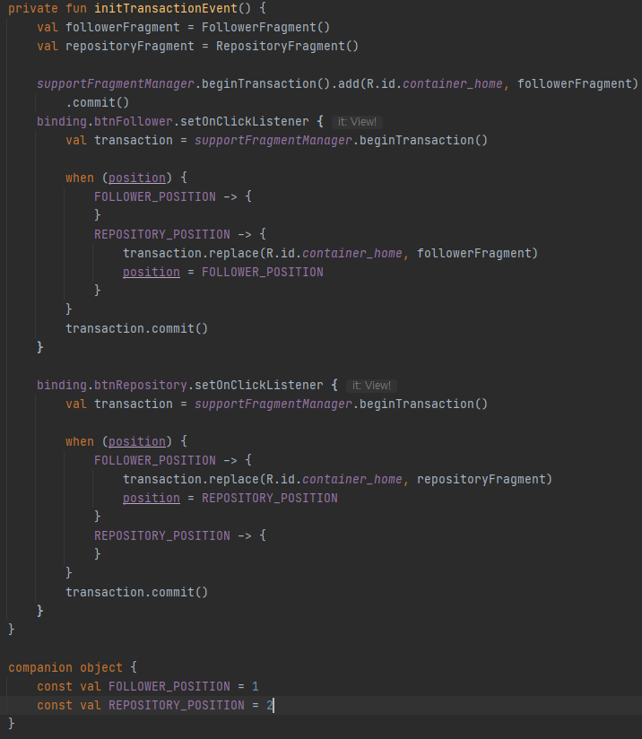

# Sopt Homework Week2
---
## Content
- Recyclerview Adapter
- Fragment 전환
- 고찰
---

## Adapter

 

 

 
인터페이스를 하나 만들고 리사이클러뷰에 데이터를 넣어주는 바인딩 어탭터를 구현한다.
그리고 리사이클러뷰 어댑터에 인터페이스의 메서드를 오버라이드하여 리사이클러뷰 안에 데이터가 변경 될 경우
notifyDataSetChanged()를 호출하게 하여 뷰를 갱신하게 하는 로직을 구현하였다.
 

 
[FollowerFragment]
사실 바인딩 어댑터를 구현했기 때문에 굳이 어댑터를 연결해줄 필요는 없지만
이후 도전과제에서 클릭을 하면 아이템의 데이터를 DetailActivity로 보내는 클릭리스너를 구현하기 위해서
일단은 TODO 리스트로 작성하게 되었다.
---

## Fragment 전환

 
[FollowerActivity]
프래그먼트 전환은 세미나 강의자료처럼 이벤트 처리를 위한 변수 'position'을 통해서 btnFollower를 눌렀을 때 when을 사용해서
분기 처리를 해주었다.
 

---
## 고찰
한번에 도전과제, 심화과제 까지 하려다가 실패해서 일단은 기본과제만 하게 되었다.
과제는 미리미리 하자는 교훈을 얻게 되었다.
주말동안 도전과제, 심화과제를 진행하려는데 팟짱님이 코드리뷰를 늦게 해주시면 좋겠다.
notifyDataSetChanged() 문제를 해결하기 위해 DiffUtil 이라는 것을 새로 알게 되었고, 이번에 한번 적용해 볼 생각이다.
이번에는 시간에 쫓겨 리팩토링을 제대로 하지 못해 아쉬웠다.
이젠 과제 나오면 그 날 바로 해야겠다.
