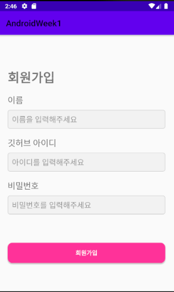

# Sopt Homework Week3
---

## 실행결과

<br>

<br>

<br>

<br>

## 코드
[signIn]
```xml
<EditText
            android:id="@+id/etId"
            android:layout_width="0dp"
            android:layout_height="wrap_content"
            android:layout_marginLeft="40dp"
            android:layout_marginTop="10dp"
            android:layout_marginRight="40dp"
            android:background="@drawable/edit_radius"
            android:hint="아이디를 입력해주세요"
            android:padding="10dp"
            android:paddingLeft="15dp"
            app:layout_constraintLeft_toLeftOf="parent"
            app:layout_constraintRight_toRightOf="parent"
            app:layout_constraintTop_toBottomOf="@+id/tvId" />
```

[signUp]
```xml
<EditText
            android:id="@+id/etName"
            android:layout_width="0dp"
            android:layout_height="wrap_content"
            android:layout_marginLeft="20dp"
            android:layout_marginTop="10dp"
            android:layout_marginRight="20dp"
            android:background="@drawable/edit_radius"
            android:hint="이름을 입력해주세요"
            android:padding="10dp"
            app:layout_constraintLeft_toLeftOf="parent"
            app:layout_constraintRight_toRightOf="parent"
            app:layout_constraintTop_toBottomOf="@+id/tvName" />

```
[HomeActivity]
```xml
<androidx.constraintlayout.widget.ConstraintLayout
            android:layout_width="match_parent"
            android:layout_height="match_parent">
            <androidx.viewpager2.widget.ViewPager2
                android:id="@+id/viewpagerHome"
                android:layout_width="match_parent"
                android:layout_height="match_parent">

            </androidx.viewpager2.widget.ViewPager2>

            <com.google.android.material.bottomnavigation.BottomNavigationView
                android:id="@+id/bottomNavHome"
                android:layout_width="match_parent"
                android:layout_height="wrap_content"
                android:background="@color/white"
                app:itemIconTint="@color/selector_menu"
                app:itemTextColor="@color/selector_menu"
                app:layout_constraintBottom_toBottomOf="parent"
                app:menu="@menu/nav_menu" />

        </androidx.constraintlayout.widget.ConstraintLayout
  ```
```kotlin
private fun initViewPager() {
       val fragmentList = listOf(ProfileFragment(), HomeFragment())

       homeActivityViewpagerAdapter = HomeActivityViewpagerAdapter(this)
       homeActivityViewpagerAdapter.fragmentList.addAll(fragmentList)
       binding.viewpagerHome.adapter = homeActivityViewpagerAdapter
   }

   private fun initBottomNavigation() {
       binding.apply {
           viewpagerHome.registerOnPageChangeCallback(object : ViewPager2.OnPageChangeCallback() {
               override fun onPageSelected(position: Int) {
                   bottomNavHome.menu.getItem(position).isChecked = true
               }
           })
           bottomNavHome.setOnNavigationItemSelectedListener {
               when (it.itemId) {
                   R.id.navigation_menu_profile -> {
                       viewpagerHome.currentItem = FIRST_FRAGMENT
                       true
                   }
                   R.id.navigation_menu_home -> {
                       viewpagerHome.currentItem = SECOND_FRAGMENT
                       true
                   }

                   else -> {
                       true
                   }
               }
           }
       }
   }
```

[HomeFragment]
```kotlin
private fun initAdapter(){
        val fragmentList = listOf(EmptyFragment(),EmptyFragment())

        homeViewpagerAdapter = HomeViewpagerAdapter(this)
        homeViewpagerAdapter.fragmentList.addAll(fragmentList)

        binding.viewpagerHomeTab.adapter = homeViewpagerAdapter
    }

    private fun initTab(){
        val tabLabel = listOf("팔로잉", "팔로워")

        TabLayoutMediator(binding.tlHome, binding.viewpagerHomeTab) { tab, position ->
            tab.text = tabLabel[position]
        }.attach()
    }
  ```


---
## 고찰
이전 주차 과제 리팩토링하며 하니 오류가 많이나서 일단 막히는 부분은 제대로 구현하지 못하였다. 디자인부분도 고려해야 할 것이 많다고 느꼈고 Glide 사용법도 다시 찾아봐야겠다.
대부분의 액티비티와 프래그먼트를 viewmodel로 구현했다가 이번에 home activity를 갈아 엎으면서 잘못된 선택이란 걸 알게 되었다.
