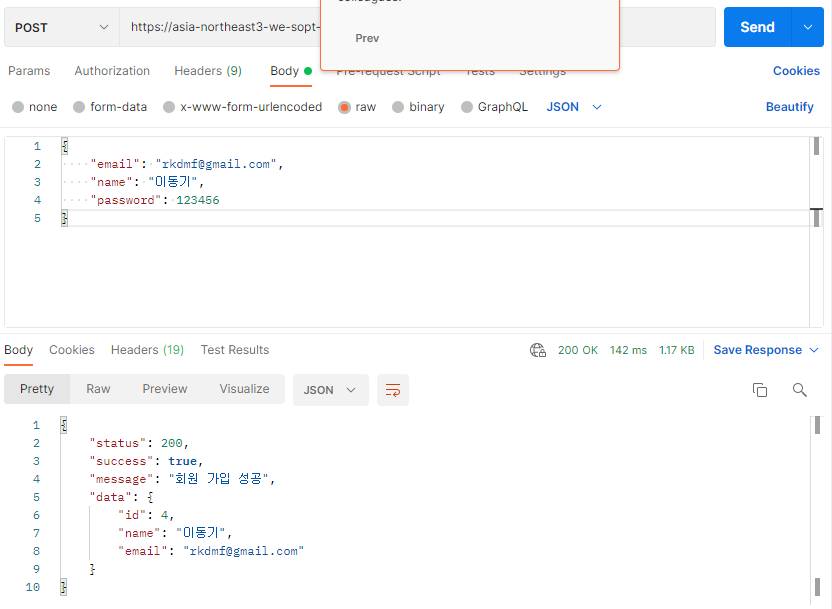
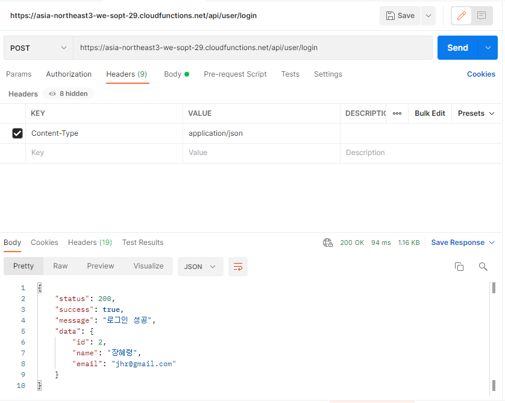
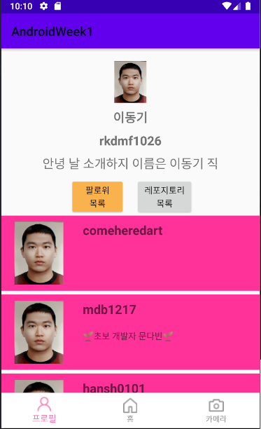

# Sopt Homework Week3
---

## 실행결과
[postman signup]

<br>
[postman login]

<br>
[git follwer api]

정보를 가져올 때, "bio"만 받아왔다.
<br>


## 코드
### 필수과제
[SampleService]

```kotlin
interface SampleService {
    @POST("user/signup")
    suspend fun requestSignUp(
        @Body body: SignUpRequest
    ): SignUpResponse

    @POST("user/login")
    suspend fun requestLogIn(
        @Body body: SignInRequest
    ): SignInResponse
}
```

[ServiceCreator]
```kotlin
private const val BASE_URL = "https://asia-northeast3-we-sopt-29.cloudfunctions.net/api/"
private val retrofit = Retrofit.Builder()
    .baseUrl(BASE_URL)
    .client(provideOkHttpClient(AppInterceptor()))
    .addConverterFactory(GsonConverterFactory.create())
    .build()

object SampleCreator {
    val sampleService: SampleService by lazy {
        retrofit.create(SampleService::class.java)
    }
}
```
[dto]
```kotlin
data class SignInRequest(
    val email: String,
    val password: String
)

data class SignUpRequest(
    val email : String,
    val name : String,
    val password : String
)
```

### 도전과제

[2-1]
```kotlin
private const val BASE_URL = "https://api.github.com/"
private val retrofit = Retrofit.Builder()
    .baseUrl(BASE_URL)
    .addConverterFactory(GsonConverterFactory.create())
    .build()

object GitCreator {
    val gitService: GitService by lazy {
        retrofit.create(GitService::class.java)
    }
}
```
```kotlin
interface GitService {
    @GET("users/{username}/followers")
    suspend fun getGitHubFollowers(
        @Path("username") userName : String
    ) : List<FollowerDao>

    @GET("users/{username}")
    suspend fun getUserInfo(
        @Path("username") userName : String
    ) : FollowerDao
}
```

```kotlin
data class FollowerDao(
    @SerializedName("login")
    val name : String,
    @SerializedName("bio")
    val introduction : String?= null
) : Serializable
```
유저 정보를 여러개 받아 올 수 있었지만 일단은 bio라는 소개글? String만 받아왔다.

[followerViewModel]
```kotlin
private fun loadFollowerApi() {
        var list = emptyList<FollowerDao>()
        viewModelScope.launch {
            try {
                val copyList = mutableListOf<FollowerDao>()
                list = GitCreator.gitService.getGitHubFollowers("rkdmf1026")
                for (follower in list)
                    copyList.add(
                        FollowerDao(
                            follower.name,
                            GitCreator.gitService.getUserInfo(follower.name).introduction
                        )
                    )
                _followerList.postValue(copyList)
            } catch (e: Exception) {
            }
        }
    }
```
먼저 follwerlist api를 호출해서 follower들의 id를 list로 받은 후 해당 list의 id를 참조하여 각각의 list에 user의 정보를 받아오는 api를 호출하였다.

---

[2-2]
```kotlin
private val retrofit = Retrofit.Builder()
    .baseUrl(BASE_URL)
    .client(provideOkHttpClient(AppInterceptor()))
    .addConverterFactory(GsonConverterFactory.create())
    .build()

object SampleCreator {
    val sampleService: SampleService by lazy {
        retrofit.create(SampleService::class.java)
    }
}

private fun provideOkHttpClient(
    interceptor: AppInterceptor
): OkHttpClient = OkHttpClient.Builder()
    .run {
        addInterceptor(interceptor)
        build()
    }

class AppInterceptor : Interceptor {
    @Throws(IOException::class)
    override fun intercept(chain: Interceptor.Chain)
            : Response = with(chain) {
        val newRequest = request().newBuilder()
            .addHeader("cute","Content-Type: application/json")
            .build()
        proceed(newRequest)
    }
}
```

---

[2-3]
```kotlin
open class GeneralResponseData(
    val status: Int? = null,
    val success: Boolean? = null,
    val message: String? = null
)

data class SignUpResponse(
    val data: Data
) : GeneralResponseData()
```
처음에 제네릭을 사용하는 방법으로 하려 했지만 잘 되지 않아서
data class에 open class를 상속하는 방식으로 해봤는데 돌아가긴 돌아가서 냅뒀다.
파트장님께서 힌트 wrapper class라고 하셨지만 구글링해도 레퍼런스가 없어서 힘들었다.
파트장님께서 의도하신 바는 아닌듯하다.

---

[3-1]

```kotlin
class SignInViewModel : ViewModel() {
    val loginStatus = MutableLiveData(false)
    val email = MutableLiveData("")
    val password = MutableLiveData("")

    fun login() {
        viewModelScope.launch {
            try {
                val code = SampleCreator.sampleService.requestLogIn(
                    SignInRequest(
                        email.value.toString(),
                        password.value.toString()
                    )
                ).message
                Log.d("1LogIn test Log", code.toString())

                loginStatus.postValue(true)
            } catch (e: Exception) {
                Log.d("2LogIn test Log",e.toString())
            }
        }
    }
}
```

```kotlin
class SignInActivity : AppCompatActivity() {
    private val binding: ActivitySignInBinding by lazy {
        DataBindingUtil.setContentView(this, R.layout.activity_sign_in)
    }
    private val viewModel: SignInViewModel by lazy {
        ViewModelProvider(this).get(SignInViewModel::class.java)
    }
    private lateinit var getResult: ActivityResultLauncher<Intent>

    override fun onCreate(savedInstanceState: Bundle?) {
        super.onCreate(savedInstanceState)
        binding.apply {
            lifecycleOwner = this@SignInActivity
            this.signInViewModel = viewModel
            getResult = registerForActivityResult(
                ActivityResultContracts.StartActivityForResult()
            ) { result ->
                if (result.resultCode == RESULT_OK) {
                    etId.setText(result.data?.getStringExtra("id"))
                    etPassword.setText(result.data?.getStringExtra("password"))
                }
            }

            viewModel.loginStatus.observe(this@SignInActivity){
                logInBtnListener(it)
            }

            btnRegister.setOnClickListener {
                val signUpIntent = Intent(this@SignInActivity, SignUpActivity::class.java)
                getResult.launch(signUpIntent)
            }
        }
    }

    private fun logInBtnListener(tf : Boolean){
        if(tf){
            val homeIntent = Intent(this@SignInActivity, HomeActivity::class.java)
            startActivity(homeIntent)
            Toast.makeText(this@SignInActivity, "이동기님 환영합니다", Toast.LENGTH_LONG).show()
        } else {
            Toast.makeText(this@SignInActivity, "로그인 실패", Toast.LENGTH_LONG).show()
        }
    }
}
```

```kotlin
<EditText
            android:id="@+id/etPassword"
            android:layout_width="0dp"
            android:layout_height="wrap_content"
            android:layout_marginTop="10dp"
            android:background="@drawable/edit_radius"
            android:hint="비밀번호를 입력해주세요"
            android:inputType="textPassword"
            android:padding="10dp"
            android:paddingLeft="15dp"
            android:text="@={signInViewModel.password}"
            app:layout_constraintLeft_toLeftOf="@id/tvId"
            app:layout_constraintRight_toRightOf="@id/etId"
            app:layout_constraintTop_toBottomOf="@+id/tvPassword" />

        <Button
            android:id="@+id/btnLogin"
            android:layout_width="0dp"
            android:layout_height="wrap_content"
            android:layout_marginBottom="20dp"
            android:background="@drawable/background_pink"
            android:text="로그인"
            android:onClick="@{() -> signInViewModel.login()}"
            android:textColor="@color/white"
            android:textStyle="bold"
            app:layout_constraintBottom_toTopOf="@+id/btnRegister"
            app:layout_constraintLeft_toLeftOf="@id/etId"
            app:layout_constraintRight_toRightOf="@id/etId" />
```

login과 signup의 코드 플로우가 비슷하여 login 코드만 설명하겠습니다.
먼저 코루틴이라는 비동기 처리 라이브러리를 사용했습니다.
viewmodel의 생명주기를 같이하는 viewmodelscope 안에서 api 호출과 같은 입출력 작업을 합니다.
양방향 데이터바인딩을 통해 버튼클릭시 edittext의 담겨있는 값으로 login api 호출합니다.
성공하게되면 loginStatus라는 livedata가 true로 변하며
Activity에서는 해당 live data를 observe하다가 true가 되면 homeactivity로 이동하는 로직을 구현했습니다.
---
## 고찰
레트로핏 사용은 몇번의 경험이 있고, api 문서가 잘 정리되어 있어서 쉽게 할 수 있었다.
git api를 사용하는 부분은 api 문서가 영어로 되어있고, response의 각 key 값이 무엇을 의미하는지 몰라 힘들었다.
또한 한번에 여러개의 api를 순차적으로 호출해야 했기 때문에 동기처리에서 어려움을 겪었다.
2-2 같은 경우에는 어떻게 하는것이 맞는지 파트장님께서 꼭 알려주시면 좋겠다.
현재 진행중인 프로젝트에서도 저렇게 중복되는 파라메터 처리에 대해서 고민이 있기 때문이다.
