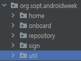
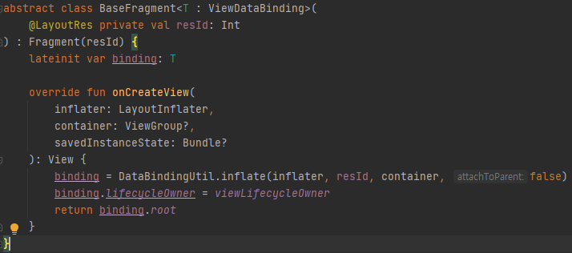

# Sopt Homework Week7
---

## 실행결과
[1-1]

[1-2]


## 코드
### 필수과제
[1-1]
```kotlin
<?xml version="1.0" encoding="utf-8"?>
<navigation xmlns:android="http://schemas.android.com/apk/res/android"
    xmlns:app="http://schemas.android.com/apk/res-auto"
    xmlns:tools="http://schemas.android.com/tools"
    android:id="@+id/navigation_onboard"
    app:startDestination="@id/firstFragment">

    <fragment
        android:id="@+id/firstFragment"
        android:name="org.sopt.androidweek.onboard.FirstOnBoardFragment"
        tools:layout="@layout/fragment_first_on_board">
        <action
            android:id="@+id/action_first_fragment_to_second_fragment"
            app:destination="@id/second_fragment" />
    </fragment>

    <fragment
        android:id="@+id/second_fragment"
        android:name="org.sopt.androidweek.onboard.SecondOnBoardFragment"
        tools:layout="@layout/fragment_second_on_board">
        <action
            android:id="@+id/action_second_fragment_to_third_fragment"
            app:destination="@id/third_fragment" />
    </fragment>

    <fragment
        android:id="@+id/third_fragment"
        android:name="org.sopt.androidweek.onboard.ThirdOnBoardFragment"
        tools:layout="@layout/fragment_third_on_board">
        <action
            android:id="@+id/action_third_fragment_to_sign_in_activity"
            app:destination="@id/sign_in_activity" />
    </fragment>

    <activity
        android:id="@+id/sign_in_activity"
        android:name="org.sopt.androidweek.sign.SignInActivity"
        tools:layout="@layout/activity_sign_in" />

</navigation>
```
[1-2]
```kotlin
class Application : Application() {
    override fun onCreate() {
        preferenceUtil = PreferenceUtil(applicationContext)
        super.onCreate()
    }

    companion object {
        lateinit var preferenceUtil: PreferenceUtil
    }
}

class PreferenceUtil(context: Context) {
    private val sharedPreferences: SharedPreferences = context.getSharedPreferences("prefs_name", 0)

    fun getString(key: String, defValue: String): String {
        return sharedPreferences.getString(key, defValue).toString()
    }

    fun setString(key: String, str: String) {
        sharedPreferences.edit().putString(key, str).apply()
    }
}
```

[SignInViewModel]
```kotlin
fun login() {
        viewModelScope.launch {
            try {
                val code = SampleCreator.sampleService.requestLogIn(
                    SignInRequest(
                        email.value.toString(),
                        password.value.toString()
                    )
                ).message
                Application.preferenceUtil.setString(EMAIL, email.value.toString())
                Application.preferenceUtil.setString(PASSWORD, password.value.toString())
                Log.d("1LogIn test Log", code.toString())

                loginStatus.postValue(true)
            } catch (e: Exception) {
                Log.d("2LogIn test Log",e.toString())
            }
        }
    }

    fun autoLogin() {
        viewModelScope.launch {
            try {
                val code = SampleCreator.sampleService.requestLogIn(
                    SignInRequest(
                        Application.preferenceUtil.getString(EMAIL,""),
                        Application.preferenceUtil.getString(PASSWORD,"")
                    )
                ).message
                loginStatus.postValue(true)
            } catch (e: Exception) {

            }
        }
    }

    private fun checkLogin(){
        if(Application.preferenceUtil.getString(EMAIL,"") != "")
            autoLogin()
    }
```
- 로그인화면의 viewmodel로 사용자가 버튼을 눌러 로그인을 할 경우 공유프레퍼런스에 입력한 email과 password가 저장된다.
- 공유프레퍼런스에 만약 email이 저장되어 있다면 autoLogin을 호출하여 공유프레퍼런스에 저장된 email과 password로 로그인로직을 처리한다.

[1-3]


- 패키징방식은 화면을 기능단위별로 나누고, util, repository(network)로 나누는 식으로 했는데 지금 보니 화면들도 ui라는 package에 넣어 저리하는것이 좋아보인다.
- baseFragment라는 util class를 만드는 이유는 자주 사용되는 fragment의 databinding을 자동으로 하기 위해서 만들게 되었다.
